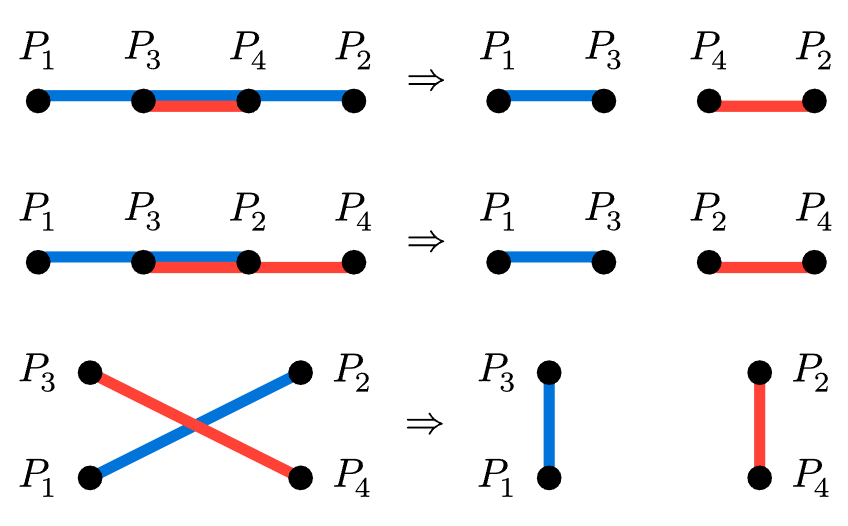
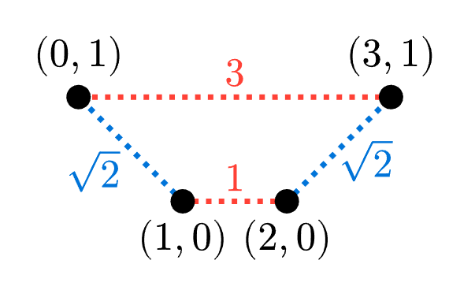

# 2025 全國資訊學科能力競賽 解說（NHSPC2025 Editorial）

## A. Brackets

### Subtask 1

不難發現只要左括號與右括號數量相同即代表它是「格式正確」。因此只要輸出兩者的數量差即可。

### Subtask 2

由於答案只會是 0 或 2，所以只需要照題目介紹的方法判斷是否為「格式正確」即可。若為「格式正確」則答案為 0，否則答案為 2。

### Subtask 3

我們先找一個配對左右括號的方式，一種作法是從左到右掃描 $p_1$ 到 $p_n$，當遇到右括號時，若左邊還有尚未配對的左括號，就將最後一個左括號與之配對。如此一來，最後剩下未配對的括號，會是右括號都在左邊、左括號都在右邊，一個直覺的想法是把這些未配對的括號都刪除作為答案。

這個作法是正確的。令 $s_i$ 為 $p_1p_2\dots p_i$ 中左括號的數量減去右括號的數量，因為有配對的左右括號是成對出現的，所以在計算 $s_i$ 時，其實只要數掃描到 $p_i$ 時，還未配對的左右括號數量即可。如果最後剩下的未配對的右括號有 $x$ 個、左括號有 $y$ 個，那麼 $s_n=y-x$、假設最後一個未配對的右括號是 $p_k$，則有 $s_k=-x$，與此同時 $s_k$ 會是 $s_0,s_1,s_2,\dots,s_n$ 之中的最小值（$s_0=0$；如果最後沒有未配對的右括號，則令 $k=0$）。

根據題目介紹的作法，「格式正確」的條件是所有的 $s_i \geq 0$ 且 $s_n=0$。刪除一個括號的效果會是一個 $s_0,s_1,\dots,s_n$ 的後綴都加上 $1$ 或 $-1$，因此
- 為了讓 $s_k$ 至少是 0，需要刪除至少 $x$ 個右括號。
- 在刪除 $x$ 個右括號後，$s_n$ 會比本來多出 $x$，需要刪除至少 $s_n+x=y$ 個右括號。

答案不能比 $x+y$ 更少了，所以上述的作法是正確的。

---

## B. Post Office

先翻譯一下問題：一個城鎮的「安全容忍範圍」是離它第 $s_i+1$ 近的郵局的距離。

### Subtask 1

只能設置一個郵局，且由題目限制可知 $s_i=0$，目標是選擇一個郵局的位置使得最遠的村莊距離盡量小，窮舉該郵局位置並每次花 $O(n)$ 時間計算最遠距離即可。事實上，若將村莊先按位置由左至右排序，使得 $x_1 \leq x_2 \leq \dots \leq x_n$，最佳的郵局位置必定是距離 $\frac{x_1+x_n}{2}$ 最近的村莊。

### Subtask 2

把題目換一個角度說，若我們想要判斷答案是否小於等於一個數字 $D$，要檢查的條件是「能否設置至多 $k$ 個郵局，使得每個村莊 $i$ 距離 $D$ 的範圍內，有至少 $s_i+1$ 個郵局」，我們稱一個村莊距離 $D$ 以內的範圍為它的「安全區間」。

要檢查這個條件，我們可以轉而計算「要求每個村莊 $i$ 的安全區間內至少有 $s_i+1$ 個郵局，總共至少需要設置幾個郵局」。先將村莊按照位置由左至右排序好，一開始我們不設置任何郵局，接著我們由左至右掃描每個村莊，當看到一個村莊時 $i$，如果有任何一個村莊 $j \leq i$，使得 $i$ 是 $j$ 的安全區間內最後一個村莊，並且 $j$ 的安全區間內郵局數量仍不足 $s_i+1$，就在編號 $\leq j$ 的最右邊的未設置郵局村莊設置郵局。最後設置的郵局數量即是最少需要的郵局數量，檢查數量是否 $\leq k$ 即可。若有村莊的安全區間內村莊數量根本就不足需要的郵局數量，那也代表無法滿足條件。

上述檢查一個 $D$ 的條件的方法，可以很容易的在 $O(n^2)$ 的時間內完成。搭配二分搜尋法找出最小的可以滿足條件的 $D$ 即是答案，總時間複雜度是 $O(n^2 \log \max x_i)$。

### Subtask 3

這筆子任務保證 $s_i=0$，亦即在 Subtask 2 的作法中，只需要檢查每個村莊的安全區間內是否有至少一個郵局。

我們可以很容易地加速 Subtask 2 的檢查過程：在掃描的過程中，用一個 queue 維護安全區間中還沒有設置郵局的村莊。在看到村莊 $i$ 時，將它加入 queue，接下來對於 queue 最前端的村莊 $j$，若 $i$ 是 $j$ 的安全區間內最後一個村莊，就在 $i$ 設置郵局，並將 queue 清空，因為 queue 中所有村莊的安全區間都包含 $x_i$。可以發現到實際上並不需要真的有這個 queue，只要記錄這個假想的 queue 中第一個村莊的位置即可。

如此一來，這個子任務就可以以 $O(n \log \max x_i)$ 時間複雜度的演算法解決。

### Subtask 4

把 Subtask 3 的作法進一步修改成能處理 $s_i$ 不一定為 0 的狀況。因為一個村莊的安全區間可能需要很多郵局，而一個村莊只能設置一個郵局，所以不像 Subtask 3 只需要在當下看到的村莊 $i$ 設置郵局，而是要如 Subtask 2 作法，從已看過而未設置郵局的村莊中最右邊的開始設置，我們可以簡單地使用一個 stack 維護已看過但還未設置郵局的村莊，需要設置郵局時從 stack pop 村莊即可。

至於前述的 queue 則改為維護「我們還不確定安全區間內郵局數量是否足夠的村莊」，先假設我們有辦法很快地知道一個村莊的安全區間內郵局數量是否有達到要求，當看到村莊 $i$ 時，先將它放入 stack 和 queue，然後若 queue 前端的村莊 $j$（此時它應該要是一個還未達到需求郵局數量的村莊）安全區間最後一個村莊是 $i$，則開始從 stack pop 村莊，直到 $j$ 需要的數量滿足為止，然後 pop queue 前端所有已被滿足條件的村莊，重複這些步驟直到 queue 為空或 $i$ 不是 $j$ 安全區間內最後一個村莊為止。

最後的問題是如何快速檢查一個村莊的安全區間內郵局數量是否已被滿足，一種很直接的方法是使用如 Fenwick tree (BIT)、線段樹或 `__gnu_pbds::tree` 的資料結構維護已設置郵局的村莊，在檢查一個村莊的條件是否被滿足時，就區間查詢安全區內的郵局數量是否足夠。上述資料結構都能在 $O(\log n)$ 的時間做到一次查詢。總時間複雜度為 $O(n \log n \log \max x_i)$。

### Subtask 5

Subtask 4 作法中唯一會需要多一個 $\log n$ 的部分是檢查一個村莊的安全區間內郵局數量是否已經足夠。實際上計算 queue 最前端的村莊 $j$ 安全區間內有幾個郵局可以很簡單的做到，因為所有村莊的安全區間長度都是 $2D$，且 queue 最前端的村莊只會是越來越右邊的村莊，因此這個我們關心郵局數量的區間可以視為是不斷往右移動，每個村莊都只會進入這個區間一次、離開這個區間一次，只要維護目前這個區間在哪裡、裡面有幾個郵局以及一個陣列維護每個村莊是否有設郵局，在設置郵局以及 queue 最前端的村莊改變時更新郵局數量，就能以 $O(n)$ 的時間完成一次對一個 $D$ 的檢查。總時間複雜度是 $O(n \log \max x_i)$。

---

## C. EV

### Subtask 1

這筆子任務沒有充電站，答案僅可能為 $0$ 或 $-1$。若起點到終點的最小耗電量 $\leq$ 初始電量 $b$，輸出 $0$，否則輸出 $-1$。

實作：將各邊的耗電量絕對值設為邊權重，利用 **Dijkstra** 尋找最短路徑，複雜度為$O((E+V)\log V)$，$V$為點數，$E$ 為邊數。

### Subtask 2

先檢查是否可以不充電直接到達終點。若需要充電，對於任一充電站 $u$，定義 $d(u)$ 為起點 $s$ 到 $u$ 的最小耗電量，$e(u)$ 為從 $u$ 到終點 $t$ 的「最低初始電量」，若可以從起點到達該充電站，則經過該站到達終點所需的充電量為 $e(u)- (b - d(u))$。最終答案為所有可到達的充點站中的最小充電量。

實作：從起點到任意一點的最小耗電量$d(u)$ 可沿用子任務一的方法求得；$e(u)$ 則透過反轉所有邊的方向，並以終點 $t$ 為起點執行一次最短路徑演算法獲得。

### Subtask 3

目標仍然是計算起點到終點的最小耗電量。

實作：新增虛擬起點 $s'$ 與邊 $(s', s)$，權重設為 $B - b$。將耗電量設為正權重，充電站的增益設為負權重。利用 **Bellman-Ford** 計算到每個點的最少耗電量 $d(u)$。在進行鬆弛（Relax）操作時，考慮邊 $(u,v)$ 且權重為 $w$ 的邊：
- 若 $d(u) + w > B$：無法經由 $u$ 抵達 $v$，不進行更新。
- 若 $0 < d(u) + w \le B$：則 $d(v) = \min(d(v), d(u) + w)$。
- 若 $d(u) + w \le 0$：耗電量最低為 0，故 $d(v) = 0$。

初始化：$d(s') = 0$，其餘節點 $d(u) = \infty$

若 $d(t) = \infty$，代表無法抵達，輸出 -1；否則輸出 0，表示不需額外充電。複雜度為 $O(VE)$

### Subtask 4

執行子任務三的演算法，求出起點到各點的最小耗電量 $d(u)$。若 $d(t)$ 已能抵達，則輸出 $0$。

和子任務二相同，對於每個可到達的充電站 $p$，計算從 $p$ 出發抵達終點 $t$ 所需的「最低初始電量」$e(p)$。實作方式為將邊反轉後，以終點 $t$ 為起點再次執行 Bellman-Ford。最終答案為$\min(e(p) - (B - d(p)))$。

---

## D. Chomp

### Subtask 1

在這筆子任務中我們只需要解決兩排的情況。透過手玩一些小測資，我們不難發現以下結論：

**[結論 1]**：在 $p_i = 0$ 的情況下，後手獲勝若且唯若 $r_i = 1$。

我們可以透過以下引理得出這個結論：

**[引理 1]**：對於任何一個 $r_i \neq 1$ 的遊戲都存在一個吃法能夠讓遊戲變成 $r_i = 1$。

**[引理 1 的證明]**

我們分成兩種情況討論：

- $r_i = 0$：這時只要吃掉最右上角的巧克力即可。
- $r_i > 1$：這時只要吃掉第 1 列的右邊 $r_i - 1$ 塊巧克力即可。

**[引理 1 證明結束]**

**[引理 2]**：對於任何一個 $r_i = 1$ 的遊戲，任何吃法都不可能讓遊戲變成 $r_i = 1$。

**[引理 2 的證明]**

我們分成兩種情況討論：

- 吃掉的區域不包含第 1 列：因為至少要吃掉一塊，所以吃完後 $r_i$ 至少為 $2$，不符合需求。
- 吃掉的區域包含第 1 列：不難發現吃完之後會變成一個 $r_i = 0$ 的盤面，不符合需求。

**[引理 2 證明結束]**

**[觀察 1]**：遊戲的結束狀態（只剩下左下角的巧克力）為一個 $r_i = 1$ 的狀態。

有了這三個引理我們就可以證明結論：若 $r_i = 1$，先手只能變成 $r_i \neq 1$ 的遊戲，但之後後手就又可以再讓遊戲變回 $r_i = 1$ 遊戲，因為每次移動巧克力的塊數會減少，所以這樣一直玩下去遲早會變成結束狀態，這時先手就輸了。同樣的道理，若 $r_i \neq 1$ 先手只要先讓遊戲變成 $r_i = 1$，就能使用同樣的方法確保勝利。

有了上述結論就能夠通過這筆子任務。

### Subtask 2

我們考慮動態規劃。定義 $dp_{i, j, k}$ 代表當目前第 1 列有 $i$ 塊巧克力、第 2 列有 $j$ 塊巧克力、第 3 列有 $k$ 塊巧克力的情況下，先手獲勝還是後手獲勝，若先手獲勝則 $dp_{i, j, k} = 1$，否則為 $0$。不難發現 base case 為 $dp_{1, 0, 0} = 0$，對於其他的情況我們可以透過枚舉先手選擇哪塊巧克力來進行轉移。具體來說，若滿足以下條件之一則 $dp_{i, j, k} = 1$，否則 $dp_{i, j, k} = 0$：

- 存在 $1 \leq x < i$ 滿足 $dp_{x, \min(x, j), \min(x, k)} = 0$。
- 存在 $0 \leq x < j$ 滿足 $dp_{i, x, \min(x, k)} = 0$。
- 存在 $0 \leq x < k$ 滿足 $dp_{i, j, x} = 0$。

以上的 dp 有 $O(n^3)$ 種狀態，轉移為 $O(n)$，因此需要花 $O(n^4)$ 的時間建出來，建完之後每筆詢問只要再花 $O(n)$ 的時間跑過每一個格子，並判斷哪一些是先手選完可以獲勝的即可。總複雜度 $O(n^4 + tn)$。

值得一提的是，以上的作法若在建表時只建 $k=0$ 時的表，狀態數會變成 $O(n^2)$，因此建表複雜度會變成 $O(n^3)$，一樣是可以通過子任務一的。

### Subtask 3

我們嘗試優化前面的 dp。注意到在計算 $dp_{i, j, k}$ 時，我們其實只在乎以下六種值：

- 滿足 $dp_{x, j, k} = 0$ 的最小 $x$。
- 滿足 $dp_{x, x, k} = 0$ 的最小 $x$。
- 滿足 $dp_{x, x, x} = 0$ 的最小 $x$。
- 滿足 $dp_{i, x, k} = 0$ 的最小 $x$。
- 滿足 $dp_{i, x, x} = 0$ 的最小 $x$。
- 滿足 $dp_{i, j, x} = 0$ 的最小 $x$。

因此只要在 dp 轉移時順便更新這些值即可在 $O(1)$ 時間完成轉移。總複雜度會降至 $O(n^3 + tn)$。

#### 另解

事實上，這題有另一種實作簡單不少的作法，主要是根據以下觀察：

**[引理 3]**：對於任意 $i, j$，不存在兩個數 $x \neq y$ 滿足 $dp_{i, j, x}$ 與 $dp_{i, j, y}$ 皆為 $0$。

**[引理 3 的證明]**

不失一般性假設 $x < y$，由於 $dp_{i, j, y}$ 所代表的盤面可以經過一步變成 $dp_{i, j, x}$，所以兩個不可能同時為先手輸的狀態。

**[引理 3 證明結束]**

有了這個觀察我們可以換另一種 dp 方式：令 $dp_{i, j}$ 代表滿足「第 1 列有 $i$ 塊巧克力、第 2 列有 $j$ 塊巧克力、第 3 列有 $k$ 塊巧克力這個盤面為後手必勝」的那個**唯一的** $k$，若不存在則 $dp_{i, j} = -1$。轉移我們一樣考慮枚舉先手選擇哪塊巧克力，但這裡只需要枚舉前 2 列即可。不難發現，先手所選擇的每一步都會對 $dp_{i, j}$ 多加至多一個它不能是多少的限制，處理完所有限制後只要再從可以選的的數字裡面挑最小值即可。

這個作法會變成一個有 $O(n^2)$ 個狀態、$O(n)$ 轉移的 dp。總複雜度為 $O(n^3 + tn)$。

---

## E. Decode

### Subtask 1

枚舉答案並用 $O(k)$ 的時間檢查一個數字是不是好的。

### Subtask 2

我們考慮對答案二分搜，定義 $f(x)$ 代表有幾個 $\leq x$ 的正整數被至少一個 $p_i$ 整除。我們的目標是要找到最小的 $x$ 滿足 $f(x) \geq n$，這個 $x$ 就會是答案。

至於 $f(x)$ 要怎麼計算呢？一個最直接的想法是先算出有幾個數字可以被 $p_1$ 整除以及有幾個被 $p_2$ 整除，並把它們加起來，但不難發現的是這樣會多算到同時被 $p_1$ 跟 $p_2$ 整除的數字，而也不難發現只要再把這樣的數字扣掉就可以了。

因此，我們可以推出：

$$
f(x) = \left\lfloor\frac{x}{p_1}\right\rfloor + \left\lfloor\frac{x}{p_2}\right\rfloor - \left\lfloor\frac{x}{\text{lcm}(p_1, p_2)}\right\rfloor
$$

，其中 $\text{lcm}(a, b)$ 代表 $a$ 與 $b$ 兩數的最小公倍數。

$f(x)$ 可以在 $O(1)$ 的時間算完，因此總複雜度會是 $O(\log C)$，其中 $C$ 為值域。

### Subtask 3

注意到對於每個 $p_i$ 只要考慮前 $n$ 小的數字即可，之後把它們蒐集起來並輸出第 $n$ 小的數即可。總複雜度 $O(nk \log nk)$。

### Subtask 4

我們延續子任務二的方法，不難發現在 $k > 2$ 時我們也可以用類似的方法推出一個足夠快速計算出 $f(x)$ 的方法。具體來說：

$$
f(x) = \sum_{s \subseteq \{p_1, p_2, \ldots, p_k\}, |s| \text{ is odd}}\left\lfloor\frac{x}{\text{lcm}(s)}\right\rfloor - \sum_{s \subseteq \{p_1, p_2, \ldots, p_k\}, |s| > 0, |s| \text{ is even}}\left\lfloor\frac{x}{\text{lcm}(s)}\right\rfloor
$$

，其中 $\text{lcm(s)}$ 為 $s$ 中所有數字的最小公倍數。

這樣一來只要枚舉子集就可以在 $O(k2^k)$ 計算完 $f(x)$，因此總複雜度會是 $O(k2^k\log C)$，其中 $C$ 為值域。

---

## F. Data Center

### Subtask 1

$D = 1$ 就是單純的最小生成樹問題，直接使用 Kruskal 或其他演算法即可。

### Subtask 2

所有邊的右界皆為 $d$ 就意味著我們只需要考慮加邊操作，不用考慮刪邊。注意到若現在我們已經有了時間 $t$ 的最小生成樹，那在時間 $t + 1$ 時我們只需要考慮位於時間 $t$ 的最小生成樹的邊以及在此時間點新增的邊即可，這樣總共只需要考慮最多 $nd + m$ 條邊。使用 kruskal 演算法找最小生成樹的話，在事先將邊照邊權排好的情況下即可在 $O(m\log m + (nd + m)\alpha(n))$ 的時間內解決這筆子任務。

### Subtask 3

在這筆子任務中，每一條邊被加到圖上後就不會被刪除了。為了方便，我們暫時假設每條邊的權重 $w_i$ 皆相異，實際上對於 $w_i$ 相同的邊，以它們的編號大小關係決定優先順序即可，在這樣的假設下，任意時刻的最小生成森林是唯一的。

對於一條邊 $i$ 來說，它會出現在最小生成森林上的條件是「在由所有此時存在的權重 $< w_i$ 的邊構成的子圖上，$u_i$ 和 $v_i$ 不連通」，而權重 $< w_i$ 的邊也只會增加不會刪除，因此會存在一個時間點 $t_i$，使得從 $t_i$ 這個瞬間起，$< w_i$ 的邊可以使得 $u_i,v_i$ 連通、在此時間點前則不連通。如果 $i$ 有任何時候會在最小生成森林上，則 $[l_i,t_i)$ 就是它在最小生成森林上的時段，如果 $i$ 從來不在最小生成森林上，我們令 $t_i=l_i$。

我們的目標變成了找到所有的 $t_i$，考慮以下的分治法，我們的分治 function $\text{solve}(L, R, S)$ 的參數有一個時間區間 $[L,R]$、一個邊的集合 $S$，集合 $S$ 中的邊 $i$ 滿足我們已知 $L \leq t_i \leq R$，這個 function 要找到所有 $S$ 中的 $i$ 的 $t_i$。

如果 $L=R$，那麼 $S$ 中的 $i$ 答案自然都是 $t_i=L=R$。否則，令 $M=\lfloor (L+R)/2 \rfloor$，我們要對於每個 $i \in S$ 判斷是否 $t_i \leq M$，方法是想辦法判斷時間點 $M$ 時 $i$ 是否在最小生成森林上，是的話代表我們知道 $t_i > M$、反之我們知道 $t_i \leq M$，令 $t_i \leq M$ 的邊為 $S_L$、$t_i > M$ 的為 $S_R$，遞迴呼叫 $\text{solve}(L, M, S_L)$ 與 $\text{solve}(M + 1, R, S_R)$ 即可。

如果 $i \in S$ 的 $l_i$ 超過 $M$，根據定義 $t_i > M$，可以直接往 $S_R$ 放。至於其他滿足 $l_i \leq M$ 的 $i \in S$，要怎麼判斷 $i$ 在時間點 $M$ 時是否在最小生成森林上呢？在分治法的過程中，我們此時會知道所有的邊 $j$ 是 $t_j < L$、$t_j > R$ 還是 $t_j \in [L,R]$：
- 對於 $t_j < L$ 的邊，它們在時間點 $M$ 時肯定都不在最小生成森林上，自然也不影響 $S$ 中的邊能不能在最小生成森林上，我們可以直接不管它們。
- 對於 $t_j > R$ 且 $l_j \leq M$ 的邊，它們在時間點 $M$ 時肯定都在最小生成森林上，所以要是這些邊構成的子圖（是一個森林）會使任何一條邊 $i \in S$ 的兩端連通，那 $i$ 在時間點 $M$ 就不可能在最小生成森林上。我們把這個森林叫作 $T$。
- 對於 $t_j \in [L,R]$ 的邊，也就是 $j \in S$，它們可能在也可能不在最小生成森林上。

只考慮 $l_i \leq M$ 的 $i \in S$，若先把在 $T$ 中屬於同一連通塊的節點縮成一個點，然後求這些被考慮的邊 $i$ 構成的最小生成森林，在這之中的 $i$ 就會在時間點 $M$ 時整張圖的最小生成森林上，反之則不會。如果可以先把 $T$ 的連通塊縮好，並且邊都有先照邊權排序了，這一步就只要花某種跟 $\lvert S \rvert$ 有關的時間。

最後剩下的問題是怎麼先把 $T$ 中的連通塊縮起來，我們維護一個 global 的 disjoint set data structure，我們希望在呼叫 $\text{solve}(L,R,S)$ 時，這個 disjoint set data structure 維護的是 $T$ 的連通狀況，在遞迴呼叫 $\text{solve}$ 時，先遞迴右邊再遞迴左邊，遞迴左邊之前，union 所有 $S_R$ 中的邊的兩端點，這樣往左邊遞迴時，disjoint set data structure 維護的正好就是我們要的 $T$。return 時也不用 undo 本來的操作。

在一個 $\text{solve}$ 中找縮點後 $l_i \leq M$、$i \in S$ 的邊 $i$ 構成的最小生成森林時，如果事先把邊按邊權排好了，使用 Kruskal 演算法只要花費均攤 $O(\|S\| \alpha(n))$ 的時間，每條邊 $i$ 至多出現在 $S$ 裡 $O(\log m)$ 次，因此總時間複雜度是 $O(m\ \alpha (n) \log m)$。

### Subtask 4

這筆子任務中所有邊權皆為 $1$，也就代表我們只需要判斷每個時間點圖是否連通，如果連通的話答案為 $n - 1$，否則為 $-1$。

我們考慮分治，定義遞迴 function $\text{solve}(L, R, E)$ 會處理所有 $L \leq t \leq R$ 的時間點的答案，且 $E$ 為目前還需要考慮的邊集合們。接著我們會依序進行以下步驟：令 $M = \lfloor\frac{L + R}{2}\rfloor$，首先我們跑過每一條邊，將邊分為兩類：第一類是完全出現在時間區間 $[L, R]$ 內的，第二類是剩下的。對於第一類的邊，既然這條邊會出現在 $[L, R]$ 的所有的時間點，那我可以直接把這條邊連接的兩個點縮成一個點。對於剩下的邊，令 $E_L$ 為會出現在時間區間 $[L, M]$ 的邊集合，$E_R$ 為會出現在時間區間 $[M + 1, R]$ 的邊集合們，接著只要再呼叫 $\text{solve}(L, M, E_L)$ 與 $\text{solve}(M + 1, R, E_R)$ 就可以完成遞迴了。而當 $L = R$ 時，我們只要判斷現在是不是那 $n$ 個點已經縮成一個點即可判斷時間點 $L$ 是否連通。

但目前還有兩個問題：第一個是要怎麼把第一類的邊的兩個點縮起來，第二個是這樣的複雜度是多少。對於第一個問題，我們只要先用一個並查集將第一類的邊加進去，之後再跑過第二類的每一條邊將它們的兩端點更新成並查集中該端點的根就可以了。至於第二個問題，注意到對於每一條邊，只會有至多一次被同時丟進 $E_L$ 與 $E_R$，也因此若我們考慮整棵遞迴樹，每一條邊只會在每一層出現至多兩次，所以遞迴傳入的 $E$ 的大小總和會是 $O(m \log d)$，因為我們會需要並查集的查詢根與合併的操作，因此整體複雜度會是 $O(m \alpha(n) \log d )$。

### Subtask 5

我們稍微改良子任務四的遞迴讓它能夠處理有權重的版本。現在因為有權重所以我們對於第一類的邊沒辦法直接將它用並查集合併起來，我們現在只能將完全出現在時間區間 $[L, R]$ 內，且在這些時間點**一定會出現在最小生成樹上**的邊們用並查集合併起來。而要找的方法很單純：我們只需要先將所有第二類的邊權假裝為 $0$ 並將它們都加進並查集裡，之後再照邊權小到大看過每條第一類的邊即可。為了方便，後續我們稱第一類好邊為這些一定會出現在最小生成樹的邊，第一類壞邊為還沒辦法確定的。

這樣做完之後就直接用相同的方法遞迴...，然而只有這樣是不夠的，因為現在我們會把第一類壞邊也丟下去遞迴，所以前面提到的每一層至多只出現兩次自然就不會成立。但注意到對於第一類壞邊們我們其實只需要留下這些邊所形成最小生成森林就行了，而這也可以利用並查集來完成。

很神奇的是做完上述的優化複雜度就變好了！我們現在來分析一下複雜度。不難發現我們現在只在乎第一類壞邊的生成森林的邊數量。現在假設第二類的邊數量為 $x$，若我們把前面「假裝權重為 $0$」的第二類邊全部拔掉，可以發現我們的連通塊數量只會增加至多 $x$，也因此當我們把所有第一類壞邊都放進去後，連通塊至多只會減少 $x$，也因此當我們只留下第一類壞邊的生成森林時，邊數量至多只會有 $x - 1$ 條。而由子任務 4 我們已經知道所有遞迴 function 的第二類邊總數量為 $O(m \log d)$，也因此上述作法需要考慮的總邊數量也會是 $O(m \log d)$。注意到我們一樣會需要並查集的查詢根與合併的操作，因此整體複雜度依然是 $O(m \alpha(n) \log d )$。

---

## G. Connections

首先，我們先簡化問題，在題目要求的四個條件中有一項「任兩條連線不可在平面上交叉或重疊，否則會彼此干擾」，實際上可以忽略這個條件，其餘三個條件以圖論的術語來說，是在一張有 $n$ 個節點的完全圖上，節點 $i,j$ 之間的邊權重為祭壇 $i,j$ 的距離，求大小為 $k$ 的最小權匹配。

可以忽略連線不可交叉重疊的原因是，只要一組解的連線有交叉或重疊，那這組解一定不是最佳的。假設最佳解中 $P_1,P_2$ 配對、$P_3,P_4$ 配對，而 $\overline{P_1P_2}$ 和 $\overline{P_3P_4}$ 相交：
- 如果兩條線段不共線，也就是它們相交在一個點 $Q$，此時這兩條連線的成本是 $\overline{P_1Q}+\overline{QP_2}+\overline{P_3Q}+\overline{QP_4}$，$P_1QP_3$ 和 $P_2QP_4$ 都是三角形，根據三角不等式，$\overline{P_1P_3}+\overline{P_2P_4}$ 會更小，因此把配對方式改成 $P_1,P_3$ 和 $P_2,P_4$ 會得到成本更低的一組解。
- 如果兩條線段共線，若一條線段完全包含另一條線段，不失一般性假設 $\overline{P_1P_2}$ 完全包含 $\overline{P_3P_4}$，且 $P_3$ 離 $P_1$ 較 $P_4$ 離 $P_1$ 近，改配 $P_1,P_3$ 和 $P_2,P_4$ 會得到更低的成本；反之，若兩條線段互不包含，不失一般性假設 $\overline{P_3P_4}$ 包含 $P_2$、$\overline{P_1P_2}$ 包含 $P_3$，則改配 $P_1,P_3$ 和 $P_2,P_4$ 也會得到更低的成本。

因此，這一組解並不是最佳解，矛盾。接下來我們都直接忽視不能有連線相交的條件。

### Subtask 1

只需要連接兩個祭壇，找最近點對即可。

### Subtask 2

$n \leq 20$ 的範圍下，可以直接使用 $O(n^2 2^n)$ 的動態規劃找出最佳解。具體來說，令 $dp[S]$ 是集合 $S$ 中的節點的最小權匹配成本，轉移時挑選兩個不在 $S$ 中的節點配對，即

\\[ dp[\varnothing]=0, \quad\forall S: \|S\| \bmod 2 = 0, \space dp[S]=\min_{u \neq v,\ u,v \in S} \{dp[S \setminus \lbrace u,v\rbrace]+w(u,v)\} \\]

答案是 $\min_{\|S\| = 2k} dp[S]$。

### Subtask 3, 4

當 $k=2$ 時，一個直覺的想法可能是先找到最近點對 $P_1,P_2$，然後再找一次除了這兩點之外點的最近點對 $P_3,P_4$，不過這不一定會得出一個最佳解，例如

上述的作法會得到紅色那組匹配，而正確答案是藍色那組。這個作法會錯誤的情形，最佳解中 $P_1,P_2$ 一定會是匹配點，只是它們兩個不是配在一起。這是因為若最佳解中 $P_1,P_2$ 任何一個不是匹配點的話，我們都可以把其中一條連線換成 $P_1,P_2$，因為 $P_1,P_2$ 是最近點對，這樣換過之後成本不會變大。

因此，除了上述作法得出的答案之外，我們只需要再考慮找到另兩個點 $P_3,P_4$，配對 $P_1,P_3$ 及 $P_2,P_4$ 的狀況，而 $P_3$ 和 $P_4$ 分別只可能是其他點之中，距離 $P_1,P_2$ 前兩近的點（需要取前兩近而不是最近是為了避免距離 $P_1,P_2$ 最近的點相同，造成同一個點被重複匹配）。在這些可能性中取最好的即為答案。

### Subtask 5, 6

一般圖最小權匹配常見的演算法是 Blossom algorithm，然而直接使用它的時間複雜度高達 $O(n^2 k)$，帶權版本的 Blossom algorithm 寫起來也相當複雜。注意到本題的 $k$ 相當小，因此我們可以選擇時間複雜度對 $k$ 而言較高、對 $n$ 而言較低的演算法。

**[定義 1]**：增廣路徑

對於一張圖上的一個匹配 $M$，一條簡單路徑 $v_0,e_0,v_1,e_1,v_2,\dots,e_k,v_{k+1}$ 是 $M$ 的增廣路徑若
- $v_0$ 和 $v_{k+1}$ 都是未匹配點。
- 對於所有 $0 \sim k$ 內的奇數 $i$，$e_i$ 是匹配邊。

一條 $M$ 的增廣路徑 $P$ 的權重 $w_M(P)$ 是其中所有非匹配邊的權重總和，減去匹配邊的權重總和。

**[定義 2]**：交錯路徑

對於一張圖上的一個匹配 $M$，一條簡單路徑是 $M$ 的交錯路徑若其中的邊交錯為匹配邊和非匹配邊。

一條 $M$ 的交錯路徑 $P$ 的權重 $w_M(P)$ 是其中所有非匹配邊的權重總和，減去匹配邊的權重總和。

很明顯地，對於一個匹配 $M$ 和它的增廣路徑 $P$，若將 $P$ 中的匹配邊都變成非匹配邊、非匹配邊都變成匹配邊，會得到一組新的合法的匹配 $M' = M \oplus P$（$\oplus$ 是邊集合的對稱差），匹配的大小會多 1、權重總和會加上 $P$ 的權重。

**[引理 1]**：令 $M$ 是大小為 $k-1$ 的最小權匹配，$P$ 是 $M$ 的最小權重增廣路徑，則 $M'=M \oplus P$ 是大小為 $k$ 的最小權匹配。

**[引理 1 的證明]**

令 $M^\*$ 是大小為 $k$ 的最小權匹配中，有最多條匹配邊在 $M$ 也是匹配邊的那組最小權匹配，考慮 $H=M \oplus M^\*$，由於每個節點在 $M,M^\*$ 的度數都至多為 1，$H$ 中每個節點的度數至多為 2，故每個連通塊皆為一條鏈或一個環。

若有連通塊是一個環 $C$，此環上的邊只屬於 $M$ 或 $M^\*$ 的其中之一，且交錯屬於 $M$ 和 $M^\*$，因此 $C$ 對 $M$ 和 $M^*$ 而言都是交錯路徑，並且 $w_M(C)=-w_{M^\*}(C)$。$M \oplus C$ 仍是一組匹配，權重比 $M$ 多 $w_M(C)$、大小不變，因 $M$ 是大小為 $k-1$ 的最小權匹配，$w_M(C) \geq 0$。而 $M^\* \oplus C$，仍是一組匹配、大小是 $k$、權重比 $M^\*$ 多 $-w_M(C) \leq 0$，因此它是一組不更差的大小為 $k$ 的匹配、和 $M$ 共用的匹配邊比 $M^\*$ 更多，和 $M^\*$ 的前提矛盾。

若有連通塊是一條鏈 $P$，和環的情形相似，這條路徑也會是交錯路徑。

若 $P$ 的邊數是偶數，其中一端會是 $M$ 的匹配邊、$M^\*$ 的非匹配邊，另一端相反，而非匹配邊那端的端點必定是未匹配點，因此 $M \oplus P$ 和 $M^\* \oplus P$ 都是合法的匹配，和環的情形相似，$M^\* \oplus P$ 是一組不更差、大小為 $k$、跟 $M$ 共用更多匹配邊的解，矛盾。

所以 $H$ 裡的每個連通塊都是長度為奇數的鏈，可以分成兩種：兩端都是 $M$ 的匹配邊，和兩端都是 $M$ 的非匹配邊，在 $M$ 中翻轉第一種會造成大小少 1、第二種會造成大小多 1，在 $M^\*$ 中翻轉則是反過來。如果兩種路徑都至少有一條，反翻轉一條後匹配大小不變，根前面環與偶數長路徑的情形相似，可以得出矛盾的結論。因為 $H$ 是 $M \oplus M^*$，在 $M$ 翻轉這每一條鏈後，匹配大小的變化量必須是 1，得出 $H$ 只能有一條第二種的鏈，並在第二種的鏈頭尾節點都會是 $M$ 的未匹配點，故它是一條增廣路徑。

如此一來，我們得出大小為 $k$ 的最小權匹配，可以經由從 $M$ 翻轉一條增廣路徑得到，翻轉權重最小的增廣路徑即可得到權重最小的結果。

**[引理 1 證明結束]**

因此，只要能夠在足夠快的時間找到最小權重的增廣路徑，重複 $k$ 次就能得到答案。增廣路徑除了要匹配邊和非匹配邊交錯之外，最需要注意的事情是必須是簡單路徑。假設目前我們已經找了大小為 $k' < k$ 的最小權匹配，如果最小權重增廣路徑的長度是 1，那麼它就是目前未匹配點之中的最近點對；若長度大於 1，則除了頭尾之外，中間的邊都是匹配邊，而匹配邊只有 $k' < k$ 條，因此只要避免使用到重複的匹配邊即可。

具體來說，令目前找到的最小權匹配是 $M$，對於邊集合 $S \subseteq M$、匹配點 $s,t$，令 $dp[S][s][t]$ 為從 $s$ 開始、$t$ 結束，經過 $S$ 中的匹配邊的最小權交錯路徑，轉移時選擇一條不在 $S$ 裡的匹配邊、決定兩端點其中之一為新的終點即可，一個狀態的轉移目標有 $k' \times 2$ 種可能，而有效狀態至多有 $2^{k'} \times k' \times k'$ 種，花費 $O\left((k')^3 2^{k'}\right)$ 的時間可以計算出所有狀態。

要得到最小權重的增廣路徑，在一條剛才計算出的交錯路徑頭尾各補上一個未匹配點即可，和 Subtask 2 相似，只須考慮頭尾分別最近的兩個未匹配點，找到最小權重為何後，回溯動態規劃以構造出增廣路徑。

找一次增廣路徑需要花費 $O\left(n \log n + (k')^3 2^{k'}\right) \leq O\left(n \log n + k^3 2^{k'}\right)$ 的時間，總時間複雜度為

\\[ \sum_{k'=0}^{k-1} O\left(n \log n + k^3 2^{k'}\right) = O\left(nk \log n + k^3 \sum_{k'}^{k-1} 2^{k'}\right)=O\left(nk \log n + k^3 2^k\right) \\]

### Subtask 7

上述作法的 $k^3 2^k$ 對 $k \leq 18$ 的限制而言相當地大，因此我們要稍微多做一點事情使複雜度降到 $O\left(nk \log n + k^2 2^k\right)$。

注意到狀態 $dp[S][s][t]$ 中有 $s$ 的目的只是為了在最後決定增廣路徑起點時，能使候選的起點只有至多 2 個（離 $s$ 最近的兩個未匹配點），事實上我們不在乎 $s$ 是哪一個點。我們稱起點的未匹配點、也就是實際增廣路徑上 $s$ 的上一個點為 $s'$。用類似的想法，而終點的未匹配點稱作 $t'$。當 $t$ 固定時，只需要考慮能使 $s'$ 到 $t$ 的路徑總權重最小的兩個 $s'$，再考慮 $t'$ 為離 $t$ 最近的兩個未匹配點其中之一，即可找到正確答案。

如此一來，狀態只需要定為 $dp[S][t]$，包含至多兩個 pair $(v,s')$，代表有使用 $S$ 中的匹配邊、從 $s'$ 到 $t$，權重為 $v$ 的交錯路徑，權重最小值為 $v$，並且只保留 $v$ 最小的兩個 $s'$ 的這個 pair，時間複雜度就減少到了 $O\left(nk \log n + k^2 2^k\right)$。

### 關於直接跑 Blossom algorithm 的作法

一個直覺的想法會是，需要考慮的點數其實沒有 $n$ 那麼多，而是只有大約 $k^2$ 的量級，因此直接使用 Blossom algorithm 可以得到 $O(k^5)$ 的時間複雜度。粗略的估計一下，會需要考慮的點有找 $k$ 次最近點對時找到的 $2k$ 個點，以及對這 $2k$ 個每一個點，距離它最近的 $k$ 個除了這些點之外的點，共 $2k(1+k)=684$ 個點，$O(k \times \|V\|^2)$ 代入大約是 $8 \times 10^6$，是可以通過的，只不過帶權的 Blossom algorithm 應該很難在比賽中寫出來。

---

## H. Diameter

### Subtask 1

不難發現只要計算圖 $G$ 的直徑即可，也就是要算出所有點對的最短路。使用 bfs 或是 floyd-warshall 演算法都可以。總複雜度會是 $O(n(n + m))$ 或是 $O(n^3)$。

### Subtask 2, 3

手玩一些圖的樣子之後我們不難得出以下觀察：

**[觀察 1]**：圖 $G \times H$ 中 $(u, v)$ 到 $(u', v')$ 的最短路長度為圖 $G$ 中 $u$ 到 $u'$ 的最短路長度加上圖 $H$ 中 $v$ 到 $v'$ 的最短路長度。

有了這個觀察後可以發現圖 $G \times H$ 的樹直徑其實就是圖 $G$ 與圖 $H$ 兩張圖的直徑加起來。子任務二因為圖是樹所以可以使用兩次 bfs 或是一般樹直徑的方法找直徑，而子任務三則可以用子任務一中所提到的對每個點為根跑 bfs，總複雜度一樣會是 $O(n(n + m))$。

### Subtask 4

注意到前面子任務三 bfs 的瓶頸會在於對每個點跑過所有還沒拜訪過的鄰居，這時若圖為稠密圖的話 $m = \Omega(n^2)$，複雜度會變成 $O(n^3)$，因此我們需要優化這部份。

我們改成用 bitset 存下這張圖的 adjacent matrix，並用一個新的 bitset 維護現在有哪些點已經被拜訪過。而當我們從 queue 中 pop 出一個新的點 $v$ 後，我們可以把 matrix 的第 $v$ 個 row 跟現在還沒被拜訪過的點取個 and，得出的 bitset 就會只剩下在這一輪要被新推進 queue 裡的點，之後我們就只要將 bitset 裡的元素一個一個取出來丟進 queue 裡面即可。

我們可以使用 `std::bitset` 進行實作，後面「取出所有元素」可以用 `bitset::_Find_First()` 這個函數來完成。注意到每次 bitset 操作會是 $O(\frac{n}{w})$，因此總複雜度會降至 $O(\frac{n^3}{w})$，是足以通過本題的。

---

## I. Parade

### Subtask 1

此為經典的區間聯集問題，可以按左界排序後嘗試擴張目前的區間或是變成新的區間，最後將聯集的所有區間長度加總即為答案。

總複雜度 $O(n\log n)$。

### Subtask 2

令 $dp_{i,j}$ 為將前 $i$ 個區間切成 $j$ 段的最大分數，$f(i,j)$ 為第 $i$ 到第 $j$ 個區間的聯集總長度。我們有
\\[dp_{i,j}=\min_{1\le x\le i}\left(dp_{x-1,j-1}+f(x,i)\right)\\]

我們可以 $O(n^3)$ 算出所有的 $f(i,j)$：考慮維護 $f(i,j)$ 的聯集區間集合 $S_{i,j}$，當我們想加入第 $(j+1)$ 個區間算出 $f(i,j+1)$ 時，只需花 $O(\|S_{i,j}\|)$ 的時間算出該區間如何影響 $S_{i,j}$ 並得到 $S_{i,j+1}$。

所以總複雜度為 $O(n^2k+n^3)$。

### Subtask 3

考慮同樣的 dp 定義和轉移。假設我們已經有所有的 $dp_{\*,j}$，而現在我們想要得到所有的 $dp_{\*,j+1}$。

對於 $i=1,2,\ldots,n$，我們需要能快速詢問 $\min_{1\le x\le i}\left(dp_{x-1,j}+f(x,i)\right)$。

考慮使用線段樹維護 $A_x=dp_{x-1,j}+f(x,i)$ 的區間最小值。(其實只要前綴最小值。)
當 $i\to i+1$ 時，我們需要更新 $f(x,i)$ 對 $A_x$ 的貢獻成 $f(x,i+1)$。對於所有 $l_{i+1}\le c\le r_{i+1}$ 的顏色 $c$，假設上一次出現的位置是 $last_c$，則可以發現會被影響($+1$)的 $x$ 範圍是 $[last_c+1,i+1]$。也就是說，只要對 $[last_c+1,i+1]$ 進行區間加值即可。

在這個 subtask 我們有 $l_{i+1}=r_{i+1}$，所以每次往下考慮 $i\to i+1$ 時，只需要考慮一個顏色的影響，而所有線段樹上的操作都是 $O(\log n)$，因此總複雜度為 $O(nk\log n)$。

### Subtask 4

我們沿用 Subtask 3 的想法，但是現在往下考慮 $i\to i+1$ 時，被影響的顏色可能很多，要考慮如何加速。

首先，與其用一個 $last$ 陣列紀錄每個顏色上次出現的時刻，我們維護一群 $(L,R,last)$ 的集合 $S$，其中每個 $(L,R,last)$ 代表顏色 $[L,R]$ 上次出現的時間是 $last$。$S$ 可以用 `std::set` 等資料結構維護。

往下考慮 $i\to i+1$ 時，考慮 $[l_{i+1},r_{i+1}]$ 對 $S$ 的影響。可以想像對於 $S$ 中的 $(L,R,last)$，如果 $[L,R]$ 和 $[l_{i+1},r_{i+1}]$ 有交集 $[L',R']$，則代表我們要對線段樹上的 $[last+1,i+1]$ 區間加上 $(R'-L'+1)$，而 $S$ 則要把 $(L,R,last)$ 的 $[L',R']$ 部分拿掉，或是如果 $[L',R']=[L,R]$ 則整個拿掉。把 $S$ 該更新和刪除的區間處理完後，再將 $(l_{i+1},r_{i+1},i+1)$ 插入 $S$ 就完成這次更新了。

這樣或許會一次更新很多個區間，但事實上，均攤起來仍然只有 $O(n)$ 次區間加值！考慮 $\|S\|$ 的變化，假設在考慮 $[l_{i+1},r_{i+1}]$ 之前 $\|S\|=s$，之後 $\|S\|=s'$，過程中做了 $t$ 次區間加值。觀察到這個區間最多和兩個 $S$ 中的區間部分相交，剩下有相交的必定是被完全覆蓋，因此 $\|S\|$ 會因此減少至少 $t-2$，而加入 $(l_{i+1},r_{i+1},i+1)$ 會讓 $\|S\|$ 增加 $1$，所以 $s-s'\ge t-2-1=t-3$。因此 $\sum t\le 3n+\|S_\mathrm{start}\|-\|S_\mathrm{final}\|\le 3n$。

由於每層 dp 均攤起來依然只有 $O(n)$ 次區間加值，總複雜度仍然是 $O(nk\log n)$。

### Remark

Subtask 4 有機會被卡常，畢竟 $O(nk)$ 個 set 操作加上 $O(nk)$ 次線段樹操作是挺大的。

這部分官解有做一個簡單的優化。注意到以上區間加值的事件集合對於現在在考慮切第幾段是獨立的，所以只要 $O(n)$ 個 set 操作就可以知道每一輪在算 $dp_{*,j}$ 時，線段樹該有哪些事件。而實測用以上方法把 set 操作次數從 $O(nk)$ 變成 $O(n)$ 會快一倍以上。

官解的執行時間為 $2$ 秒整，所以時限 $6$ 秒應該不至於卡很緊，如果被卡到的話可能真的是實作常數過大了。(驗題者就算沒有上述的優化還是能通過。)
